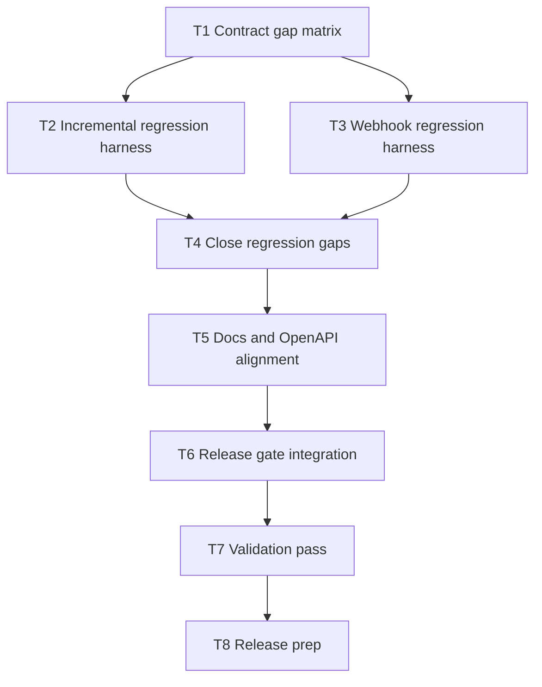

# v0.2.0 Contract Gap Matrix

Date: 2026-02-26  
Branch task: `T1` (`feat/t1-contract-gap-matrix`)  
Scope: incremental sync contract behavior, webhook contract behavior, API security-response semantics, and release-gate coverage.

## Dependency Graph

## Matrix

| ID | Contract Area | Source of Truth | Current Evidence | Gap | Planned Fix Task |
| --- | --- | --- | --- | --- | --- |
| G1 | Incremental invalid-input handling (`/products`) | `INCREMENTAL_SYNC_CONTRACT.md`, README error schema | `actionProducts()` returns payload directly and does not convert `page.errors` to HTTP `400` | Invalid `cursor`/`updatedSince` can return `200` with embedded errors | `T4` |
| G2 | Changes snapshot field consistency | README `/changes` item shape (`updatedAt`) | `ReadinessService::appendOrderChanges()` uses `dateUpdated` in order snapshots | Mixed timestamp key naming in change payload snapshots | `T4` |
| G3 | Credential parser strictness | `.docs/security-audit-2026-02-21-r3.md` recommendation | `SecurityPolicyService::parseCredentials()` accepts scalar values in keyed object mode | Misconfigured credential JSON can create unintended valid tokens | `T4` |
| G4 | Cache semantics for guarded JSON responses | `.docs/security-audit-2026-02-21-r3.md` recommendation | Guarded JSON responses do not set explicit no-store headers | Authenticated responses can be cached by intermediaries in misconfigured deployments | `T4` |
| G5 | Incremental regression automation | Roadmap `T6` + milestone `I7` | `scripts/qa/incremental-regression-check.sh` is missing | No repeatable gate for cursor precedence/types continuity | `T2` |
| G6 | Webhook contract regression automation | Roadmap `T5`/`T6` + webhook docs | `scripts/qa/webhook-regression-check.sh` is missing | Queue/signature guards are not script-regression-tested | `T3` |
| G7 | OpenAPI parity with runtime behavior | README + error taxonomy + runtime guards | OpenAPI responses omit common guarded error outcomes for most routes | Generated client docs under-represent runtime error envelope | `T5` |
| G8 | Release-gate reliability | `scripts/qa/release-gate.sh` | Gate references v0.2 harness scripts that are missing from repo | Release gate can fail due missing files instead of contract violations | `T6` |

## Exit Criteria

- All `G*` rows are resolved with code/docs changes in `T2`..`T8`.
- `scripts/qa/release-gate.sh` runs v0.2 static checks successfully by default.
- Optional live checks execute both security and incremental harnesses when `BASE_URL` + `TOKEN` are provided.
