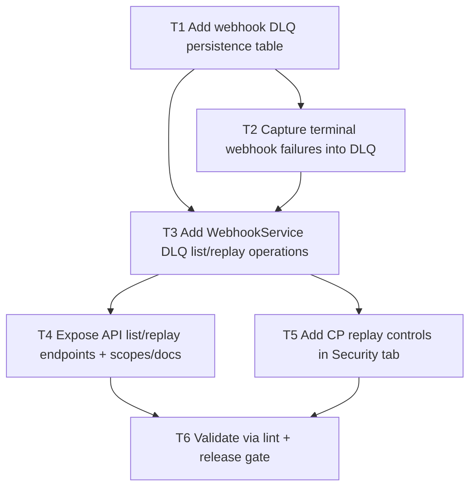

# F01 Webhook DLQ + Replay

Date: 2026-03-02  
Branch: `feature/f01-webhook-dlq-replay`

## Goal

Failed webhook deliveries should be captured in a dead-letter queue and replayable from both CP and API.

## Dependency Graph

## Tasks

- `T1` `depends_on: []`
  - Add migration for `agents_webhook_dlq` table and indexes.

- `T2` `depends_on: [T1]`
  - On terminal webhook failure (final retry), store payload + error in DLQ.

- `T3` `depends_on: [T1, T2]`
  - Implement list/replay methods in `WebhookService`.

- `T4` `depends_on: [T3]`
  - Add guarded API endpoints for DLQ list/replay.
  - Add scopes to capabilities/OpenAPI metadata.

- `T5` `depends_on: [T3]`
  - Add Security tab DLQ view and replay actions.

- `T6` `depends_on: [T4, T5]`
  - Run `php -l` on changed PHP files.
  - Run `scripts/qa/release-gate.sh`.
