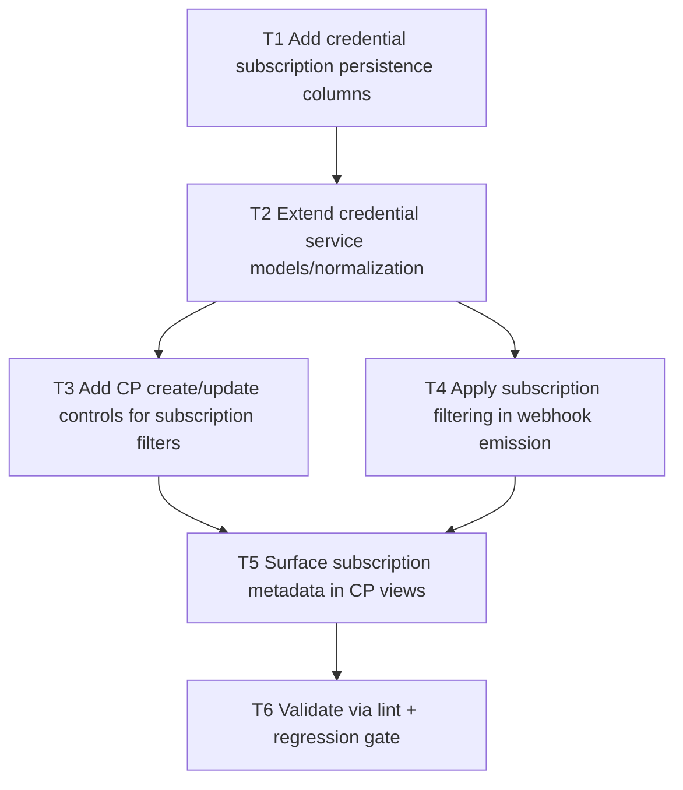

# F02 Per-Credential Webhook Subscriptions

Date: 2026-03-02  
Branch: `feature/f02-per-credential-webhook-subscriptions`

## Goal

Support per-credential webhook subscriptions so integrations can subscribe only to specific resource types/actions instead of always receiving a global webhook firehose.

## Dependency Graph

## Tasks

- `T1` `depends_on: []`
  - Add migration columns for webhook subscription filters on managed credentials.

- `T2` `depends_on: [T1]`
  - Update `CredentialService` hydration/create/update logic to store and expose per-credential subscriptions.

- `T3` `depends_on: [T2]`
  - Add CP input controls for selecting webhook resource types/actions per credential.
  - Persist selections via Dashboard credential actions.

- `T4` `depends_on: [T2]`
  - Update `WebhookService` to evaluate per-credential subscriptions and suppress unmatched events when subscription mode is active.

- `T5` `depends_on: [T3, T4]`
  - Show subscription mode/status in CP credential listing for operator visibility.

- `T6` `depends_on: [T5]`
  - Run `php -l` on changed PHP files.
  - Run `scripts/qa/webhook-regression-check.sh`.
  - Run `scripts/qa/credential-lifecycle-regression-check.sh`.
  - Run `scripts/qa/release-gate.sh`.
