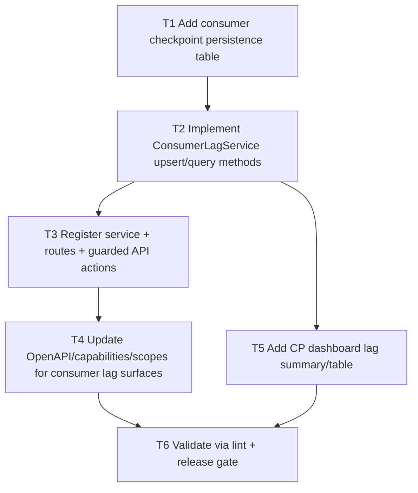

# F03 Consumer Lag Dashboard

Date: 2026-03-02  
Branch: `feature/f03-consumer-lag-dashboard`

## Goal

Track the last successful cursor/checkpoint per integration and expose lag/drift in API + CP so operators can quickly detect stale consumers.

## Dependency Graph

## Tasks

- `T1` `depends_on: []`
  - Add `agents_consumer_checkpoints` migration with per-integration/resource checkpoint fields and indexes.

- `T2` `depends_on: [T1]`
  - Add `ConsumerLagService` for checkpoint upsert/list/summary with lag bucket derivation.

- `T3` `depends_on: [T2]`
  - Register service in plugin and add routes/actions:
    - `POST /agents/v1/consumers/checkpoint`
    - `GET /agents/v1/consumers/lag`

- `T4` `depends_on: [T3]`
  - Add scopes + capabilities + OpenAPI entries for consumer lag endpoints.

- `T5` `depends_on: [T2]`
  - Render consumer lag summary/table in CP dashboard for operator visibility.

- `T6` `depends_on: [T4, T5]`
  - Run `php -l` on changed PHP files.
  - Run `scripts/qa/release-gate.sh`.
