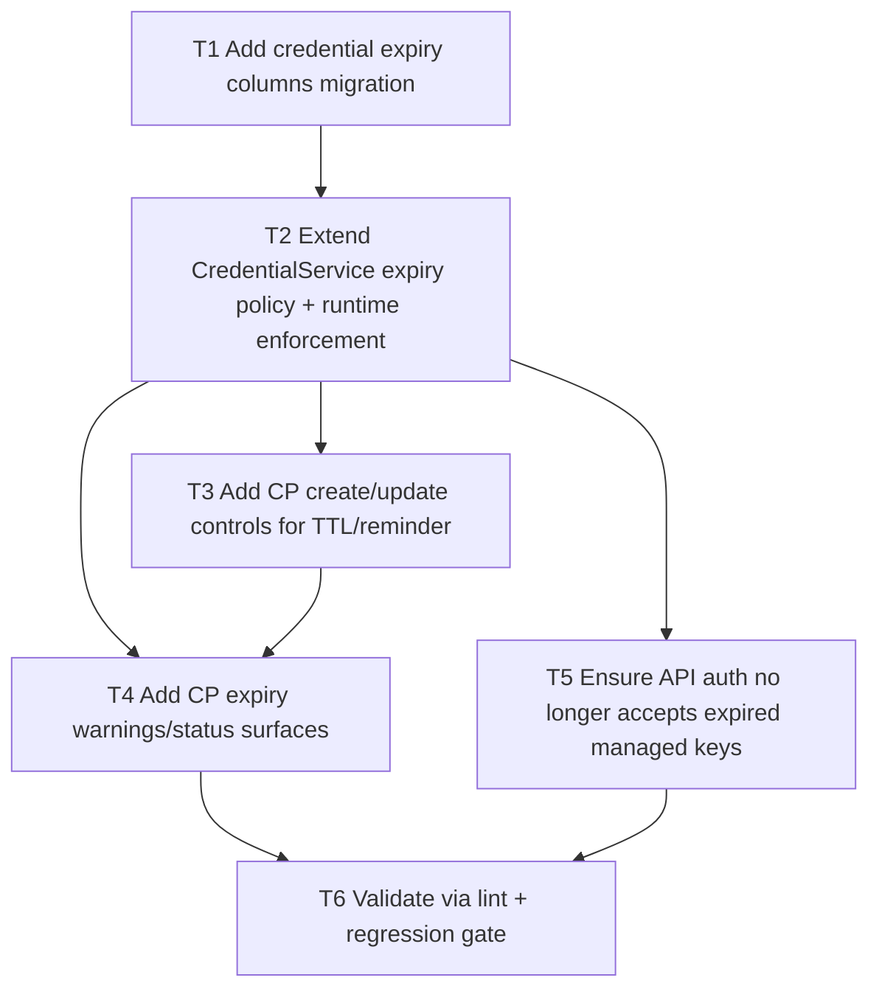

# F04 Credential Expiry Policies

Date: 2026-03-02  
Branch: `feature/f04-credential-expiry-policies`

## Goal

Add optional credential TTL/expiry policies with rotation reminder windows, enforce expired-key auth rejection, and show expiring/expired warnings in CP.

## Dependency Graph

## Tasks

- `T1` `depends_on: []`
  - Add migration columns for managed credential expiry timestamp + reminder window.

- `T2` `depends_on: [T1]`
  - Implement expiry policy persistence/hydration in `CredentialService`.
  - Exclude expired managed keys from runtime auth credentials.

- `T3` `depends_on: [T2]`
  - Add CP fields for TTL days and reminder days in credential create/update flows.

- `T4` `depends_on: [T2, T3]`
  - Add expiring soon / expired visibility in credentials CP table + summary.

- `T5` `depends_on: [T2]`
  - Confirm API auth path implicitly enforces expiry through runtime credential filtering.

- `T6` `depends_on: [T4, T5]`
  - Run `php -l` on changed PHP files.
  - Run `scripts/qa/credential-lifecycle-regression-check.sh`.
  - Run `scripts/qa/release-gate.sh`.
