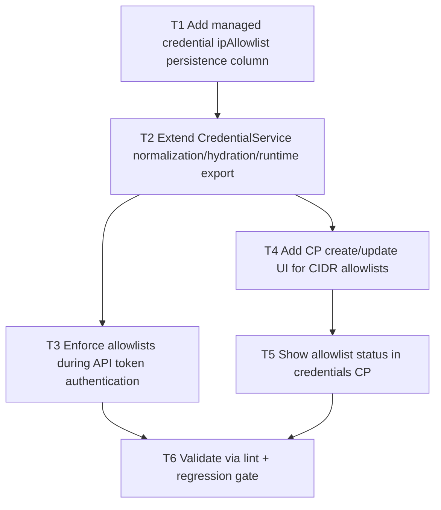

# F05 Credential IP Allowlists

Date: 2026-03-02  
Branch: `feature/f05-credential-ip-allowlists`

## Goal

Allow managed API keys to define CIDR allowlists and enforce those network boundaries during auth.

## Dependency Graph

## Tasks

- `T1` `depends_on: []`
  - Add migration column for managed credential CIDR allowlists.

- `T2` `depends_on: [T1]`
  - Persist/normalize allowlist CIDRs in `CredentialService`.
  - Expose allowlist data in runtime + CP credential payloads.

- `T3` `depends_on: [T2]`
  - Enforce CIDR checks in API auth for matched managed credentials.

- `T4` `depends_on: [T2]`
  - Add CP inputs for allowlists on create/update forms.

- `T5` `depends_on: [T4]`
  - Add allowlist visibility in CP status table.

- `T6` `depends_on: [T3, T5]`
  - Run `php -l` on changed files.
  - Run `scripts/qa/credential-lifecycle-regression-check.sh`.
  - Run `scripts/qa/release-gate.sh`.
