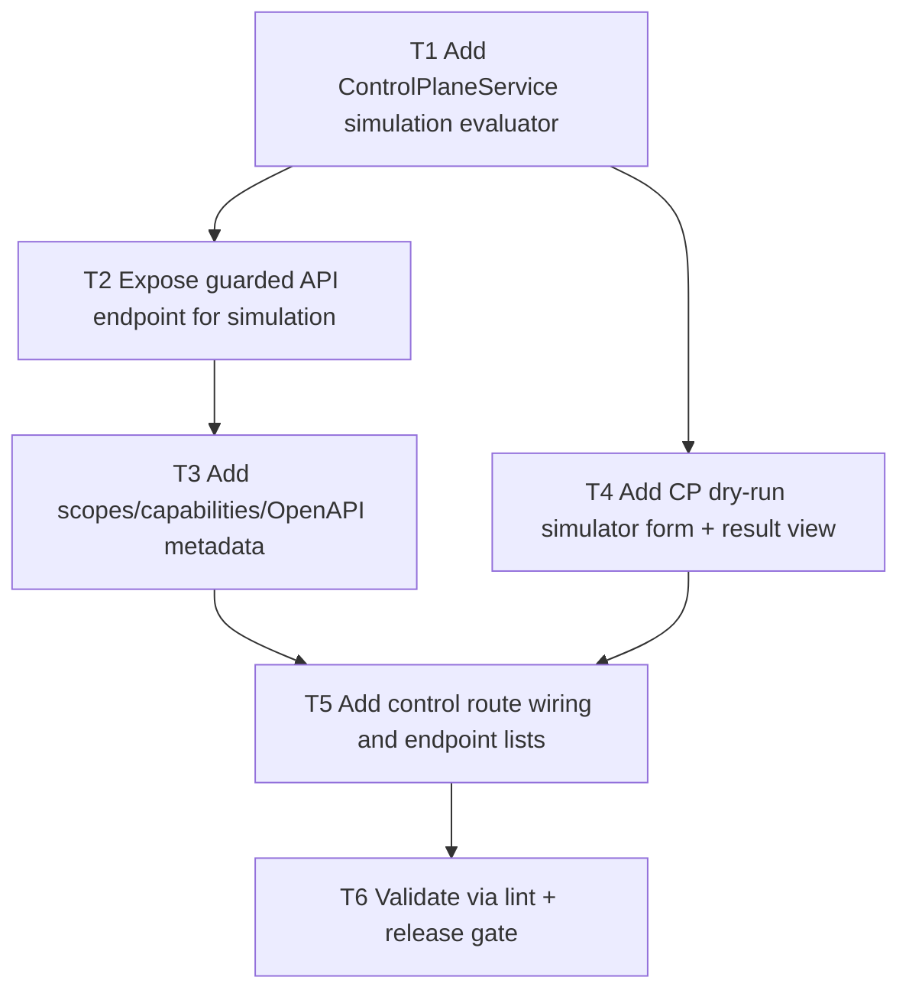

# F06 Policy Simulator (Dry-Run)

Date: 2026-03-02  
Branch: `feature/f06-policy-simulator-dry-run`

## Goal

Add a policy simulator that evaluates control actions against policy + approval requirements without executing or mutating action/execution state.

## Dependency Graph

## Tasks

- `T1` `depends_on: []`
  - Implement `simulateAction()` in `ControlPlaneService` that returns deterministic policy/approval evaluation outcomes without execution writes.

- `T2` `depends_on: [T1]`
  - Add `POST /agents/v1/control/policy-simulate` API action.

- `T3` `depends_on: [T2]`
  - Add simulation scope and include endpoint in capabilities + OpenAPI descriptors.

- `T4` `depends_on: [T1]`
  - Add CP “Policy Simulator (Dry Run)” form and response panel in Return Requests area.

- `T5` `depends_on: [T3, T4]`
  - Register route wiring and include simulator endpoint in CP API endpoint list.

- `T6` `depends_on: [T5]`
  - Run `php -l` on changed files.
  - Run `scripts/qa/release-gate.sh`.
