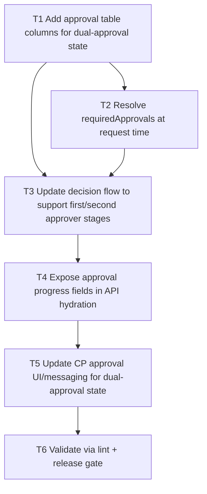

# F07 Two-Person Approvals

Date: 2026-03-02  
Branch: `feature/f07-two-person-approvals`

## Goal

Require dual decision for high-risk control actions, with clear approval-progress state in API and CP.

## Dependency Graph

## Tasks

- `T1` `depends_on: []`
  - Add approval columns for required approvals, second approver identity, and second decision timestamp/reason.

- `T2` `depends_on: [T1]`
  - Determine `requiredApprovals` at request creation based on policy risk/config thresholds.

- `T3` `depends_on: [T1, T2]`
  - Update decision logic: first approval keeps request pending; second distinct approver finalizes approval.

- `T4` `depends_on: [T3]`
  - Add approval progress fields in hydrated approval payloads.

- `T5` `depends_on: [T4]`
  - Update CP decision feedback/table visibility for dual-approval progress.

- `T6` `depends_on: [T5]`
  - Run `php -l` on changed files.
  - Run `scripts/qa/release-gate.sh`.
