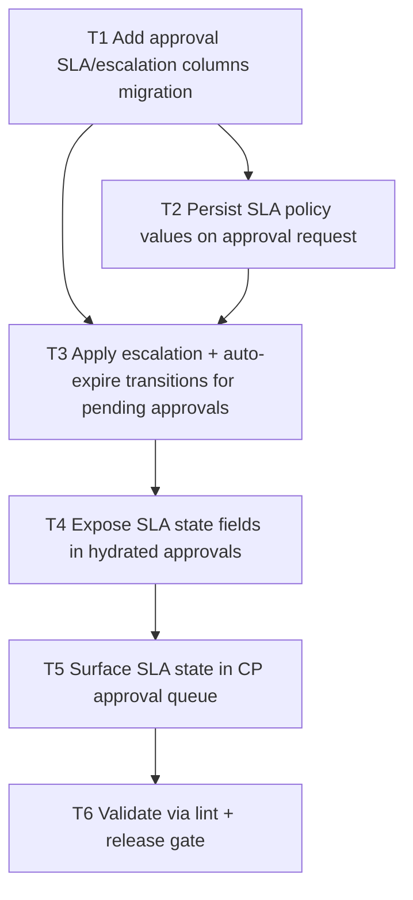

# F08 Approval SLA + Escalation Rules

Date: 2026-03-02  
Branch: `feature/f08-approval-sla-escalation-rules`

## Goal

Add SLA/escalation/auto-expire behavior for pending approvals, with surfaced state in API and CP.

## Dependency Graph

## Tasks

- `T1` `depends_on: []`
  - Add approval columns: SLA due timestamp, escalation/expiry thresholds, escalatedAt, expiredAt.

- `T2` `depends_on: [T1]`
  - Resolve/store SLA policy values from matched policy config on approval request.

- `T3` `depends_on: [T1, T2]`
  - Add escalation processor that marks pending approvals as escalated/expired based on configured thresholds.

- `T4` `depends_on: [T3]`
  - Add hydrated approval fields for SLA state and timing diagnostics.

- `T5` `depends_on: [T4]`
  - Show SLA state in CP pending approvals table.

- `T6` `depends_on: [T5]`
  - Run `php -l` on changed files.
  - Run `scripts/qa/release-gate.sh`.
