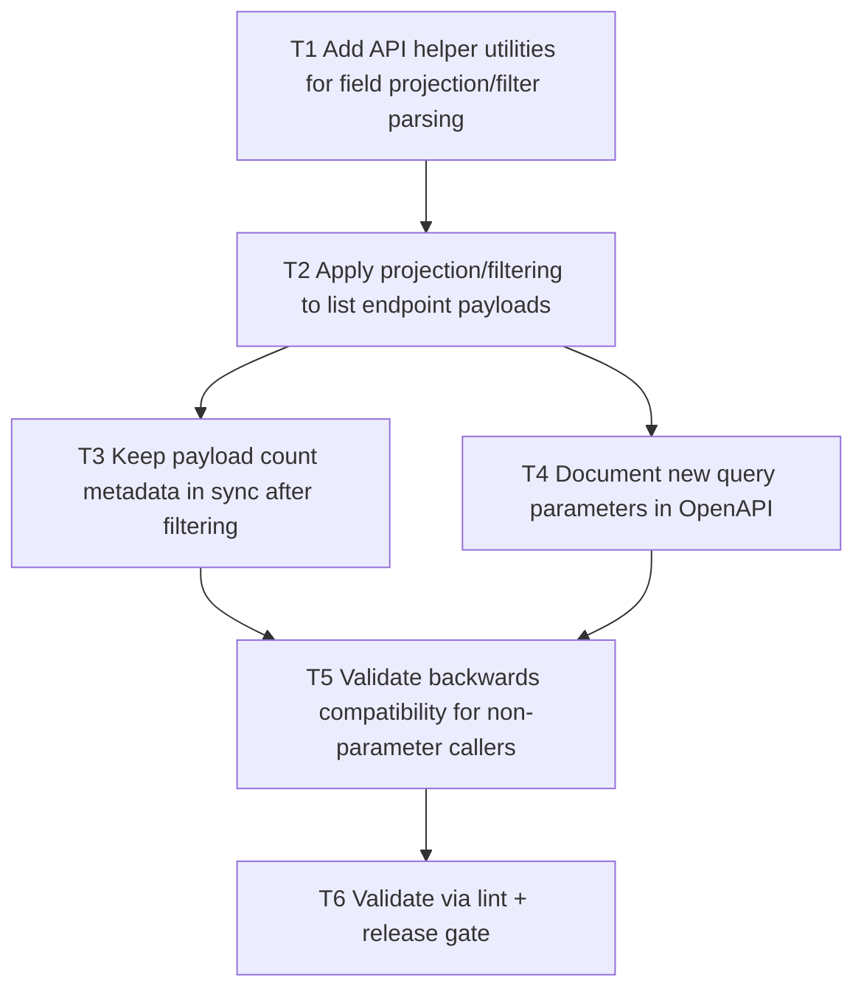

# F09 Fields Projection + Filtering

Date: 2026-03-02  
Branch: `feature/f09-fields-projection-filtering`

## Goal

Add `fields=` projection and richer `filter=` expressions on list endpoints to reduce payload size/cost for integrations.

## Dependency Graph

## Tasks

- `T1` `depends_on: []`
  - Implement reusable helpers for `fields` parsing, `filter` parsing, nested-path extraction, and projection output shaping.

- `T2` `depends_on: [T1]`
  - Apply helpers to `/products`, `/orders`, `/entries`, and `/changes` list payloads.

- `T3` `depends_on: [T2]`
  - Keep `meta.count`/`page.count` values updated after filtering.

- `T4` `depends_on: [T2]`
  - Add `fields`/`filter` parameter docs to OpenAPI for list endpoints.

- `T5` `depends_on: [T3, T4]`
  - Ensure default responses are unchanged when params are absent.

- `T6` `depends_on: [T5]`
  - Run `php -l` on changed files.
  - Run `scripts/qa/release-gate.sh`.
