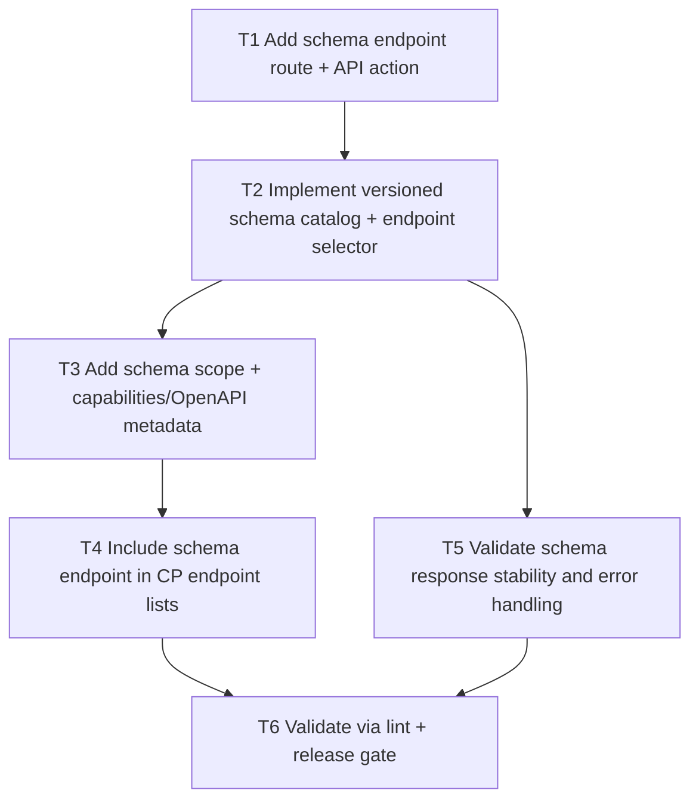

# F10 Versioned Schema Endpoint

Date: 2026-03-02  
Branch: `feature/f10-versioned-schema-endpoint`

## Goal

Publish machine-readable endpoint schemas by API version for safer client generation and integration validation.

## Dependency Graph

## Tasks

- `T1` `depends_on: []`
  - Add route/action for `GET /agents/v1/schema`.

- `T2` `depends_on: [T1]`
  - Build versioned schema catalog and allow optional endpoint selection (`endpoint` query).

- `T3` `depends_on: [T2]`
  - Add `schema:read` scope and include endpoint in capabilities/OpenAPI.

- `T4` `depends_on: [T3]`
  - Include schema endpoint in CP API endpoint references.

- `T5` `depends_on: [T2]`
  - Return deterministic `400` for unknown endpoint/version requests.

- `T6` `depends_on: [T4, T5]`
  - Run `php -l` on changed files.
  - Run `scripts/qa/release-gate.sh`.
