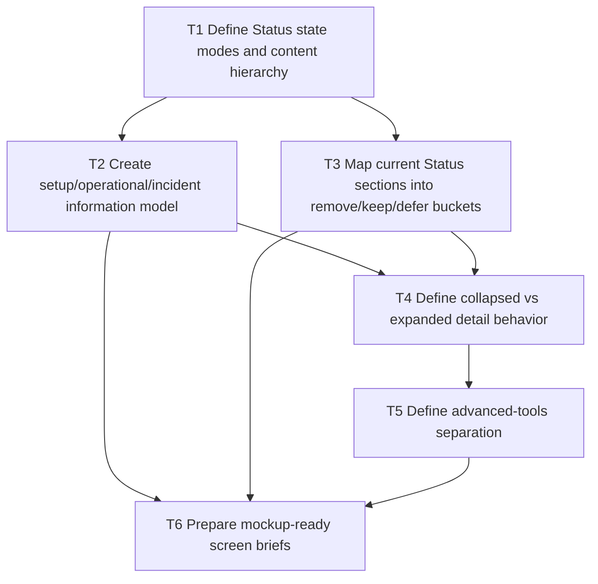

# F24 Status Page Mode Split and Density Reduction

Date: 2026-03-19  
Status: Proposed design brief  
Branch: `feature/f24-status-mode-split`

## Summary

The current `Status` page is trying to serve three jobs at once:

- first-run setup
- day-to-day operational confidence
- incident investigation

That creates too much information density for the default state, especially when the environment is healthy and unused.

This brief keeps the existing design language and the large verdict line at the top, but simplifies everything that comes after it.

Core rule:

- the operator should understand what matters and what to do next without reading a readiness dossier

## Design Direction

Keep:

- the top verdict line and verdict treatment
- the current muted card/header language
- the existing CP-native table/card rhythm
- the idea that `Status` can expand into operational detail

Change:

- what is shown by default
- how much detail is visible before expansion
- the order of information
- the separation between setup, operations, and advanced tools

Do not change in this slice:

- the big verdict line at the top
- the overall page shell/layout language already established across Agents
- the underlying readiness model

## Product Model

Split the page conceptually into three states:

1. `Setup`
2. `Operational`
3. `Incident`

The same page can support all three, but the default content density must vary by state.

### `Setup`

Used when:

- runtime is healthy enough to begin
- first meaningful machine usage has not happened yet

Tone:

- optimistic
- guided
- low-density

### `Operational`

Used when:

- the environment has real activity
- there is no meaningful fault condition

Tone:

- calm
- confidence-oriented
- more detailed than setup, but still restrained

### `Incident`

Used when:

- something is actually degraded or blocked

Tone:

- direct
- action-oriented
- detail can increase because urgency justifies it

## Target Content Hierarchy

### Level 1: Verdict and next action

This stays at the top and remains dominant.

Show:

- existing large verdict line
- one short supporting sentence
- one primary next action based on the current state

Examples:

- `Create managed account`
- `Open account connection details`
- `Review blocked runtime setting`

### Level 2: Essential summary only

Replace the current dense multi-panel proof area with a much lighter default summary.

For `Setup`, show only 3 short answer blocks:

- `Runtime`
  - enabled / blocked
- `Accounts`
  - first account created / not created
- `Connection`
  - first successful machine use seen / not seen

Optional fourth block:

- `Webhooks`
  - optional / configured

Each block should answer:

- what is the state?
- is action needed?

Not:

- expose all sub-signals inline

### Level 3: Guided action panel

Below the essential summary, show a short state-appropriate guidance panel.

For `Setup`:

- `You are ready to connect your first worker.`
- compact checklist:
  - runtime enabled
  - first account created
  - first successful authenticated request

For `Operational`:

- `The environment is operating normally.`
- short note about where to inspect details if needed

For `Incident`:

- one short explanation of the blocking/degraded reason
- one or two direct remediation actions

### Level 4: Expandable system detail

Move the current proof-grid style detail behind disclosure.

Label examples:

- `View system details`
- `Open readiness details`

Expanded content can include:

- hard gates
- traffic / access
- delivery / webhooks
- integration / capacity
- accounts / policy
- confidence / observability

The content can stay structurally similar, but it should not dominate the first viewport.

### Level 5: Advanced utilities

Treat these as tools, not core content.

Group separately under a lower section such as:

- `Advanced tools`
- `Operational tools`

Include here:

- diagnostics bundle
- webhook probe
- webhook test sink

These should remain available, but should not sit directly in the main setup path.

## Remove / Keep / Defer

### Remove from default first viewport

- full proof card matrix
- action mapping table
- diagnostics bundle block as a primary surface
- webhook probe card
- webhook test sink card
- dense sub-signal copy under every category

These can remain in the page, but not in the default first-run view.

### Keep in the design system

- top verdict line
- muted header strip treatment
- current page shell and content width
- Craft-native buttons and disclosure patterns
- the ability to expose deeper operational detail when needed

### Defer for later

- major readiness model rewrites
- new telemetry taxonomy
- incident-specific secondary views or tabs
- heavy new visual treatments unrelated to the current Agents language

## Three Mockup States

### 1. Setup state: `Ready to Connect`

Purpose:

- help the operator start

Above the fold:

- big verdict line unchanged
- short explanatory sentence
- primary CTA: `Create managed account`
- 3–4 minimal summary blocks
- short guided checklist

Below the fold:

- optional `View system details`
- advanced tools collapsed or clearly separated

### 2. Operational state: `Ready`

Purpose:

- reassure and orient

Above the fold:

- big verdict line unchanged
- shorter supporting line
- small summary strip
- optional secondary CTA: `View system details`

Below the fold:

- expanded operational detail available
- advanced tools remain separate

### 3. Incident state: `Degraded` or `Blocked`

Purpose:

- explain the problem and route action

Above the fold:

- big verdict line unchanged
- one clear reason sentence
- one primary remediation CTA
- 2–3 issue cards only for affected domains

Below the fold:

- action mapping
- full detail and utilities

Only in incident mode should higher density be accepted by default.

## Visual and Interaction Rules

- Keep the page aligned with the current Agents design system.
- Do not introduce a radically new layout grammar.
- Use disclosure and state-based density reduction, not a wholly different visual language.
- Use one dominant CTA at the top.
- Keep summary language short and verdict-oriented.
- Advanced tools should feel available, not loud.

## Dependency Graph

## Mockup Acceptance Criteria

A Status mockup is on the right path if:

- the large verdict line remains intact
- the first viewport feels materially calmer than today
- a healthy setup state no longer reads like a monitoring console
- the operator can identify the next action in under a few seconds
- advanced tools are still present but clearly secondary
- the screen remains visually consistent with current Agents cards, headers, and shell structure

## Assumptions

- this is a design-direction brief, not an implementation plan for the full readiness model
- current runtime and readiness logic largely stays in place for now
- the primary value is reducing perceived density and improving action clarity
- implementation should come later, after mockups are reviewed

## Screen-by-Screen Copy Blocks

Use these as starting copy for mockups. The goal is not final marketing prose. The goal is short, confident, low-density product language that helps the operator move.

### 1. Setup State: `Ready to Connect`

#### Verdict support line

- `Core runtime is healthy and ready for your first account or integration.`

Alternative:

- `Agents is ready for first use. Create an account or connect a worker to get started.`

#### Primary CTA

- `Create managed account`

#### Secondary CTA

- `Connect a worker`

#### Optional tertiary action

- `View system details`

#### Essential summary blocks

Block 1:

- label: `Runtime`
- value: `Ready`
- support: `Core services are available.`

Block 2:

- label: `Accounts`
- value: `Not created`
- support: `Create your first managed account when you're ready to connect a worker.`

Block 3:

- label: `Connection`
- value: `Waiting`
- support: `No authenticated machine activity has been seen yet.`

Optional block 4:

- label: `Webhooks`
- value: `Optional`
- support: `Enable only if you need push-based wake-ups instead of polling.`

#### Guided panel

Title:

- `Start with one account`

Body:

- `You do not need to set up the whole system first. Create one managed account, connect a worker, and confirm the first authenticated request.`

Checklist labels:

- `Runtime is enabled`
- `First account created`
- `First authenticated request succeeds`

#### Advanced tools section label

- `Advanced tools`

Intro:

- `Diagnostics and webhook utilities are available when you need them, but they are not required for first setup.`

### 2. Operational State: `Ready`

#### Verdict support line

- `Agents is operating normally. Review details only if you need to inspect the current runtime posture.`

Alternative:

- `The environment is healthy and ready for ongoing machine traffic.`

#### Primary CTA

- `View system details`

#### Secondary CTA

- `Open Accounts`

#### Essential summary blocks

Block 1:

- label: `Runtime`
- value: `Healthy`
- support: `Core runtime is enabled and stable.`

Block 2:

- label: `Accounts`
- value: `Active`
- support: `Managed accounts are available for machine access.`

Block 3:

- label: `Traffic`
- value: `Observed`
- support: `Recent machine activity has been recorded.`

Optional block 4:

- label: `Webhooks`
- value: `Configured` or `Optional`
- support: `Delivery is available when your workflows need it.`

#### Guidance panel

Title:

- `Everything looks healthy`

Body:

- `Use the detailed view for diagnostics, delivery checks, and deeper operational review.`

#### Advanced tools section label

- `Operational tools`

Intro:

- `Use these only when validating delivery paths or investigating runtime behavior.`

### 3. Incident State: `Blocked`

#### Verdict support line

Default:

- `Agents is not currently ready for live machine traffic. Resolve the issue below before relying on this environment.`

If runtime disabled by env:

- `Agents is disabled by environment configuration. Update the runtime setting before connecting machine traffic.`

If database/services issue:

- `Core runtime dependencies need attention before Agents can accept machine traffic.`

#### Primary CTA

Examples:

- `Review runtime setting`
- `Open plugin settings`
- `Resolve blocking issue`

#### Secondary CTA

- `View system details`

#### Minimal issue cards

Card 1:

- label: `Runtime`
- value: `Blocked`
- support: `Agents is currently disabled.`

Card 2:

- label: `Impact`
- value: `No machine traffic`
- support: `Guarded requests cannot run until the blocking issue is resolved.`

Card 3:

- label: `Next step`
- value: `Review setting`
- support: `Start with the blocking configuration instead of the broader system details.`

#### Guided panel

Title:

- `Fix the blocking issue first`

Body:

- `Once the blocking condition is cleared, the rest of the runtime can be reviewed normally.`

#### Advanced tools section intro

- `Detailed diagnostics and webhook tools remain available below if you need them after resolving the primary issue.`

### 4. Incident State: `Degraded`

#### Verdict support line

- `Agents is handling traffic, but one or more conditions need attention. Start with the affected area below.`

Alternative:

- `The runtime is working, but some signals need review before this environment should be treated as fully healthy.`

#### Primary CTA

- `Review affected area`

#### Secondary CTA

- `View system details`

#### Minimal issue cards

Card pattern:

- label: affected domain, for example `Traffic`, `Delivery`, or `Observability`
- value: `Needs attention`
- support: one short reason only

Example supports:

- `Auth, scope, or rate-limit issues were observed recently.`
- `Webhook delivery failures need review.`
- `Monitoring confidence is limited by stale or thin signals.`

#### Guided panel

Title:

- `Start with the highest-signal issue`

Body:

- `Use the detailed view if you need the full readiness breakdown, but begin with the affected area first.`

## Tone Rules For Copy Review

When refining mockup copy, keep these rules:

- prefer `ready`, `blocked`, `waiting`, `optional`, `active`
- avoid `posture`, `surface`, `capability`, `governance`, `telemetry` in first-view copy
- keep support text to one sentence
- never explain more than the next decision requires
- if the operator can act, lead with the action
- if the operator cannot act yet, explain why briefly and calmly
