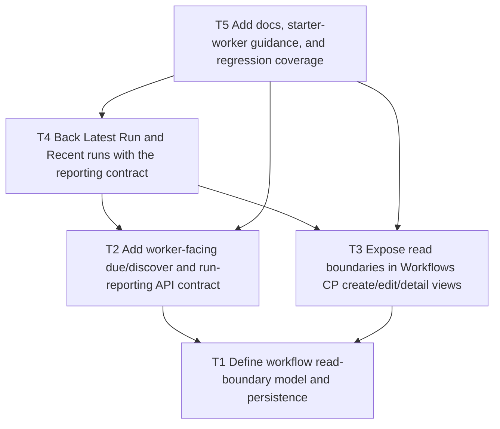

# F26 Bounded Read Workflow Boundaries and Run Reporting

Date: 2026-03-22  
Status: Proposed

## Summary

`Workflows` now exist as a real CP surface, but the current slice still has two structural gaps:

- read-only workflows do not yet have explicit operator-managed read boundaries
- recent-run visibility still needs a first-class worker reporting contract

This slice closes both gaps without turning Agents into a job runner or broad account-wide read filter.

The first implementation should stay narrow:

- workflow-scoped bounded read selectors
- worker-facing due/discover + run-reporting endpoints
- real `Latest Run` / `Recent runs` data

It should not:

- create a generic read-policy system for the whole API
- turn `Target Sets` into a mixed read/write abstraction yet
- add webhook-first execution
- introduce a second execution model outside the existing external-runtime pattern

## Product Direction

### Core rule

- operators define the workflow read boundary
- external runtimes execute inside that boundary
- Agents records workflow run state and audit-friendly summaries

### First supported boundary shape

Use a workflow-scoped read boundary model for the first slice.

The first version should support optional selectors for:

- entries
- sections
- sites
- products

The selectors should be optional because some audit-style workflows still need broad read access.

### First supported reporting shape

Workers need a simple, explicit contract for:

- discovering due workflows
- marking a run as started
- marking a run as succeeded, failed, blocked, or approval-requested
- writing a short structured summary back

That contract should back the CP surfaces directly.

## Dependency Graph

## Tasks

- `T1` `depends_on: []`
  - Define a workflow-scoped read-boundary model.
  - Store it on the workflow instance rather than creating a global account-wide read filter.
  - Add persistence for optional selectors:
    - `entryIds`
    - `sectionHandles`
    - `siteIds`
    - `productIds`
  - Normalize empty selectors to “unbounded”.
  - Keep the first version compatible with current read-only workflow types.

- `T2` `depends_on: [T1]`
  - Add a worker-facing workflow runtime contract in the API.
  - Minimum endpoints:
    - list or claim due workflows
    - fetch workflow instance detail/config
    - report run lifecycle events
  - Minimum reported states:
    - `started`
    - `succeeded`
    - `failed`
    - `blocked`
    - `approval_requested`
  - Persist:
    - timestamps
    - summary
    - optional notes
    - optional linked approval IDs

- `T3` `depends_on: [T1]`
  - Add bounded-read controls to `Workflows` CP create/edit.
  - Show operator-readable boundary summaries in:
    - registry rows
    - workflow detail
    - handoff bundle/readme
  - Keep the UI light:
    - optional selectors
    - no giant matrix
    - no pressure to configure boundaries when they are not needed

- `T4` `depends_on: [T2, T3]`
  - Back the `Latest Run` and `Recent runs` surfaces with real run-report data.
  - Replace placeholder wording where the product currently warns that recent-run rows need external writes.
  - Surface:
    - status
    - relative time
    - short summary
    - approval linkage where relevant

- `T5` `depends_on: [T2, T3, T4]`
  - Update docs for:
    - bounded read workflow boundaries
    - worker runtime polling/reporting
    - operator expectations for `Latest Run`
  - Update starter-worker or handoff bundle guidance so the reporting contract is explicit.
  - Add regression coverage for:
    - workflow-boundary persistence
    - due/discover API exposure
    - run-report lifecycle writes
    - CP rendering of boundary summaries and recent runs

## Target Files

Expected primary files:

- `src/services/WorkflowService.php`
- `src/controllers/ApiController.php`
- `src/controllers/DashboardController.php`
- `src/templates/workflows.twig`
- `src/templates/dashboard.twig`
- `docs/cp/index.md`
- `docs/workflows/*` where needed
- `scripts/qa/workflow-regression-check.sh`

Likely supporting files:

- `src/Plugin.php`
- migration file(s) for workflow boundary / run-report storage changes
- starter-worker or handoff-bundle generation inside `WorkflowService`

## Acceptance Criteria

- Operators can optionally constrain a workflow’s read surface to explicit entries/sections/sites/products.
- Workers can discover due workflows through a documented API contract.
- Workers can report run lifecycle outcomes through a documented API contract.
- `Latest Run` and `Recent runs` in the CP are backed by intentional reporting data.
- The workflow slice remains poll-first and external-runtime-first.
- `Target Sets` remain write-bound and are not collapsed into a confusing mixed boundary model.

## Validation

- `bash scripts/qa/workflow-regression-check.sh`
- `php -l` on touched PHP files
- `ddev exec php craft up --interactive=0`
- quick curl checks for:
  - `https://agents-sandbox.ddev.site/admin/agents/workflows`
  - worker-facing workflow API endpoints

## Notes

- This slice is the best next follow-on to `Workflows` because it turns the new CP surface into a real operational contract.
- It should land before provider-backed copilot/orchestration work and before broader delegated operator-access ideas.

## Implementation Order Into F27

`F26` should establish the runtime truth first.

The intended order is:

1. define workflow-scoped read boundaries
2. define the worker-facing due/discover and run-reporting contract
3. back `Latest Run` and `Recent runs` with intentional data
4. only then expose broader machine-facing discovery and bootstrap in `F27`

That means `F26` is the slice that answers:

- what a workflow instance is allowed to read
- how a worker discovers due work
- how a worker reports execution state back

And `F27` should build on that rather than inventing a second overlapping workflow model.

Practical boundary:

- `F26` makes workflow execution state intentional
- `F27` makes workflow discovery and bootstrap intentional

If sequencing pressure forces a split inside `F26`, the minimum viable handoff into `F27` is:

- stable workflow instance shape
- stable due/discover endpoint shape
- stable run-status writeback shape
- stable boundary summary shape for CP and API reuse
