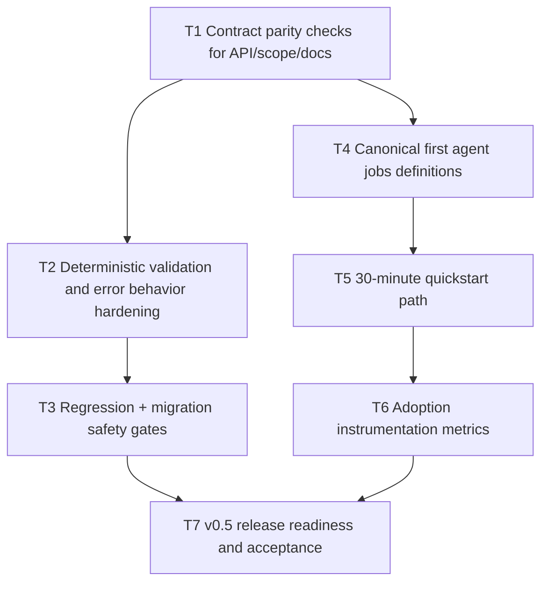

# V0.5 Dual-Track Execution Plan

Date: 2026-03-03  
Branch: `ux/cp-views-sprint`

## Goal

Deliver `v0.5.0` with reliability hardening (Track A) and measurable adoption acceleration (Track B).

## Dependency Graph

## Tasks

- `T1` `depends_on: []`
  - Add automated parity gate for endpoint + scope contract consistency across API, route map, and README docs.

- `T2` `depends_on: [T1]`
  - Normalize 400/403/404 deterministic error envelopes for malformed and unsupported requests.
  - Tighten request validation branches to avoid ambiguous behavior.

- `T3` `depends_on: [T2]`
  - Expand regression scripts for auth/control/webhook/consumer paths.
  - Add migration safety checks to release gate.

- `T4` `depends_on: [T1]`
  - Define three canonical first agent jobs with concrete API flows and sample payloads.

- `T5` `depends_on: [T4]`
  - Add quickstart flow optimized for first successful action in under 30 minutes.

- `T6` `depends_on: [T5]`
  - Instrument first-call success funnel, time-to-first-success, and active credential usage signals.

- `T7` `depends_on: [T3, T6]`
  - Finalize v0.5 acceptance checklist and release-readiness criteria.
