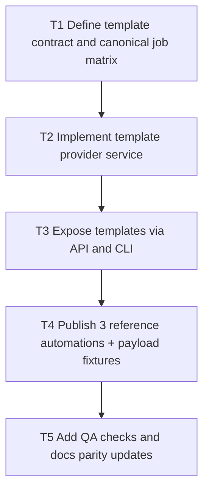

# V0.9 Step 1: Schema/OpenAPI Templates + Reference Automations

Date: 2026-03-05
Branch: `feature/v09-step1-templates-automations`

## Goal

Deliver machine-consumable integration templates derived from existing `/openapi.json` + `/schema`, plus three canonical reference automations with executable examples and QA coverage.

## Dependency Graph

## Tasks

- `T1` `depends_on: []`
  - Define stable template envelope (id, intent, requiredScopes, endpointSequence, schemaRefs, openapiRefs, sampleCommands).
  - Lock canonical jobs for this step:
    - catalog/content sync loop
    - support context lookup
    - governed return/approval run

- `T2` `depends_on: [T1]`
  - Add internal service that builds templates from runtime contract metadata.
  - Ensure deterministic output ordering for CI/doc diffs.

- `T3` `depends_on: [T2]`
  - Add read endpoint for template catalog under `/agents/v1/*`.
  - Add CLI command to print template catalog (`human` + `--json=1`).
  - Wire scope/capabilities/openapi/schema parity for the new surface.

- `T4` `depends_on: [T3]`
  - Add 3 reference automation docs and sample payload fixtures.
  - Include schema/openapi links in each automation.
  - Keep examples copy/paste-ready.

- `T5` `depends_on: [T4]`
  - Add QA script that validates template contract + automation doc presence + fixture JSON validity.
  - Hook QA script into release gate.

## Acceptance Criteria

- `/agents/v1/templates` (or equivalent) returns deterministic template catalog.
- CLI exposes same template data.
- 3 canonical reference automations are present with schema/openapi references and runnable examples.
- QA gate enforces template/docs fixture integrity.

## Validation

- `./scripts/qa/release-gate.sh`
- Targeted template regression script
- Manual smoke with token-authenticated template endpoint call
