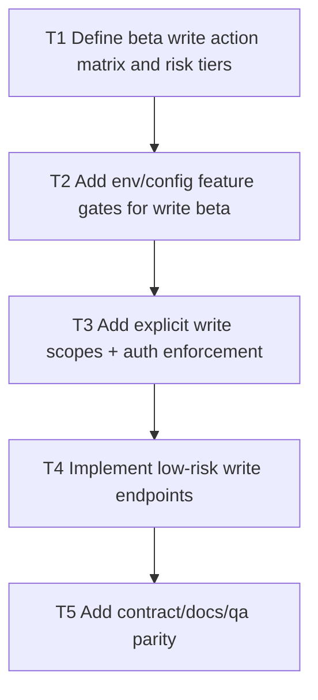

# V0.9 Step 2: Write Beta Track (Flag-Gated)

Date: 2026-03-05
Branch: `feature/v09-step2-write-beta-track`

## Goal

Introduce a strictly gated beta write track with explicit write scopes and environment controls, starting with low-risk operations only.

## Dependency Graph

## Tasks

- `T1` `depends_on: []`
  - Define first low-risk write actions and non-goals.
  - Define rollout defaults (off by default in all environments).

- `T2` `depends_on: [T1]`
  - Add feature gate envs/settings for write beta.
  - Ensure gated endpoints disappear from discovery when disabled.

- `T3` `depends_on: [T2]`
  - Add dedicated `*:write` scopes for beta actions.
  - Enforce strict scope checks + deterministic errors.

- `T4` `depends_on: [T3]`
  - Implement first low-risk write operations with idempotent request semantics where possible.
  - Add audit metadata capture hooks.

- `T5` `depends_on: [T4]`
  - Update capabilities/openapi/schema/readme/docs.
  - Add regression tests for gate-off, missing-scope, and happy path.

## Acceptance Criteria

- Write beta is fully disabled by default.
- Enabled beta writes require explicit scope and return deterministic errors otherwise.
- Discovery and docs reflect gate-aware behavior.
