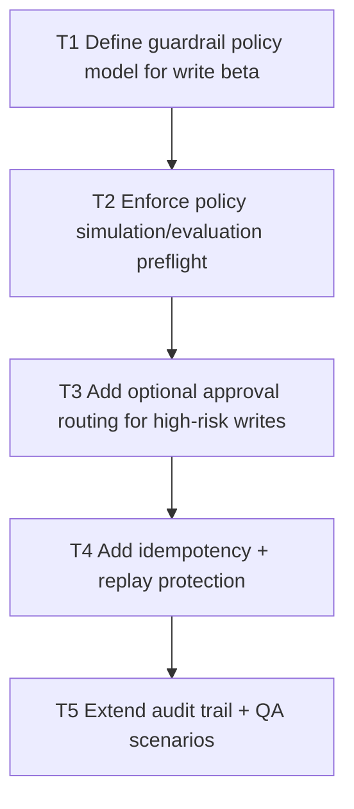

# V0.9 Step 3: Governed Write Guardrails

Date: 2026-03-05
Branch: `feature/v09-step3-write-guardrails`

## Goal

Wrap beta write operations with policy simulation/evaluation, optional dual approvals, idempotency, and audit guarantees.

## Dependency Graph

## Tasks

- `T1` `depends_on: []`
  - Define policy hooks and threshold model per write action.

- `T2` `depends_on: [T1]`
  - Add required policy preflight path before execution.

- `T3` `depends_on: [T2]`
  - Route high-risk writes through approval queues when enabled.

- `T4` `depends_on: [T3]`
  - Require idempotency keys for guarded actions.
  - Prevent duplicate execution on retries.

- `T5` `depends_on: [T4]`
  - Ensure full audit event chain for request, decision, execute, replay.
  - Add race/retry regression coverage.

## Acceptance Criteria

- Guarded write path is policy-first and auditable end to end.
- High-risk writes require approval when configured.
- Duplicate execution is prevented by idempotency controls.
