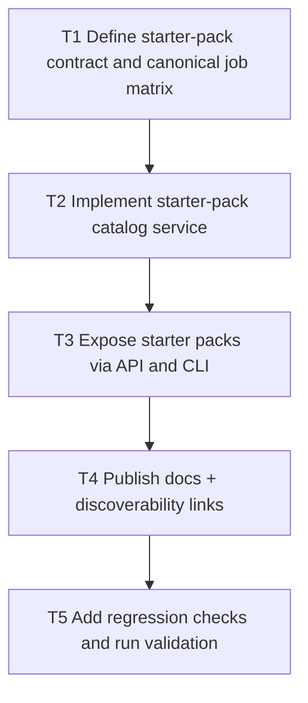

# V0.9 Step 4: Integration Starter Packs

Date: 2026-03-05
Branch: `feature/v09-step4-integration-starter-packs`

## Goal

Publish copy/paste starter packs (curl + JS + Python) for canonical jobs to reduce time-to-first-success, with discoverability centered on docs/API/CLI (not CP).

## Dependency Graph

## Tasks

- `T1` `depends_on: []`
  - Lock starter-pack envelope: `id`, `displayName`, `intent`, `requiredScopes`, `runtimes`.
  - Keep canonical jobs aligned with template ids from Step 1:
    - `catalog-sync-loop`
    - `support-context-lookup`
    - `governed-return-approval-run`

- `T2` `depends_on: [T1]`
  - Implement starter-pack service generating deterministic `curl`, `javascript`, and `python` snippets.
  - Reuse template metadata as source of truth for id, intent, scopes, and endpoint sequence.

- `T3` `depends_on: [T2]`
  - Add `GET /agents/v1/starter-packs` (optional `?id=`) under existing read scope posture.
  - Add CLI command `craft agents/starter-packs` with `--template-id` and `--json=1`.
  - Wire capabilities/openapi/schema parity references.

- `T4` `depends_on: [T3]`
  - Publish `docs/integration-starter-packs.md`.
  - Add discovery links from README + quickstart + reference automation docs.
  - Keep discoverability rooted in docs/API/CLI, without adding CP UI surface.

- `T5` `depends_on: [T4]`
  - Add regression script for starter-pack coverage (service/api/cli/docs presence + required env placeholders).
  - Integrate into release-gate and run targeted validation.

## Acceptance Criteria

- Each canonical job has `curl` + `javascript` + `python` starter examples from one catalog source.
- API + CLI expose consistent starter-pack content.
- Docs and quickstart link to the same starter-pack flows.
- QA gate fails if starter-pack surfaces drift or required placeholders are missing.
