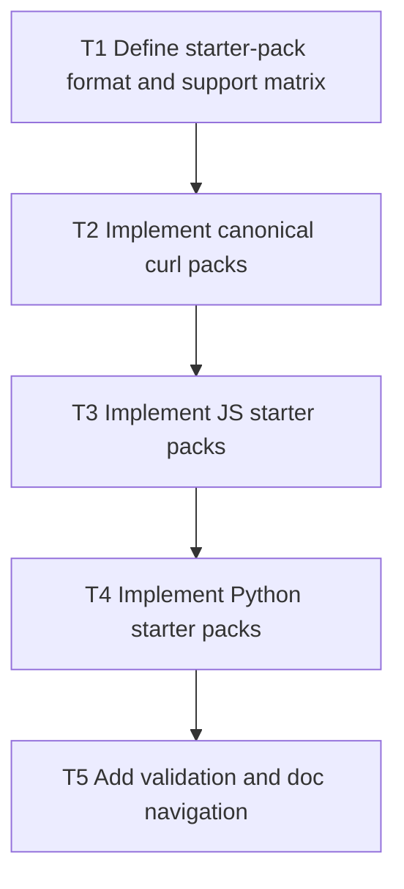

# V0.9 Step 4: Integration Starter Packs

Date: 2026-03-05
Branch: `feature/v09-step4-integration-starter-packs`

## Goal

Publish copy/paste starter packs (curl + JS + Python) for canonical jobs to reduce time-to-first-success.

## Dependency Graph

## Tasks

- `T1` `depends_on: []`
  - Define consistent structure for starter pack docs and sample configs.

- `T2` `depends_on: [T1]`
  - Add curl-first starter packs for 3 canonical jobs.

- `T3` `depends_on: [T2]`
  - Add JS/Node starter variants with same flows.

- `T4` `depends_on: [T3]`
  - Add Python starter variants with same flows.

- `T5` `depends_on: [T4]`
  - Add lint/validation of snippets and required env placeholders.
  - Add docs index linking packs from quickstart/bootstrap pages.

## Acceptance Criteria

- Each canonical job has curl + JS + Python starter examples.
- Samples are consistent in scopes/endpoints with contract docs.
