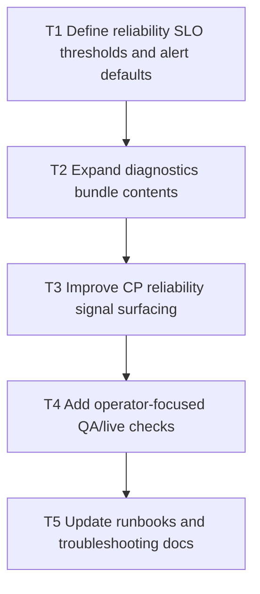

# V0.9 Step 5: Operator Reliability Pack

Date: 2026-03-05
Branch: `feature/v09-step5-operator-reliability`

## Goal

Improve operational safety with stronger default alerts, richer diagnostics artifacts, and clearer incident triage paths.

## Dependency Graph

## Tasks

- `T1` `depends_on: []`
  - Define actionable thresholds for auth failures, lag, queue depth, DLQ growth, and 5xx spikes.

- `T2` `depends_on: [T1]`
  - Enrich diagnostics bundle with alert-context snapshots and key config posture.

- `T3` `depends_on: [T2]`
  - Surface key reliability indicators and links to runbook actions in CP.

- `T4` `depends_on: [T3]`
  - Add regression checks for reliability payload shape and thresholds.

- `T5` `depends_on: [T4]`
  - Update runbooks/troubleshooting docs to match new reliability pack.

## Acceptance Criteria

- Operators can triage common incidents from CP + diagnostics bundle without code inspection.
- Reliability thresholds are documented and testable.
