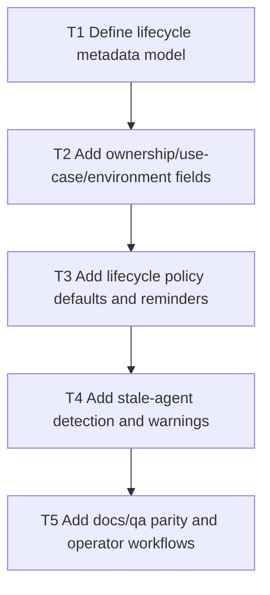

# V0.9 Step 6: Agent Lifecycle Controls

Date: 2026-03-05
Branch: `feature/v09-step6-agent-lifecycle-controls`

## Goal

Strengthen managed-agent lifecycle controls with ownership metadata, rotation/expiry posture defaults, and stale-agent governance.

## Dependency Graph

## Tasks

- `T1` `depends_on: []`
  - Define canonical metadata fields and validation rules.

- `T2` `depends_on: [T1]`
  - Add CP + API support for ownership/use-case/environment metadata.

- `T3` `depends_on: [T2]`
  - Add default expiry/rotation recommendations and reminders.

- `T4` `depends_on: [T3]`
  - Add stale-agent detection heuristics and warning states in CP.

- `T5` `depends_on: [T4]`
  - Update lifecycle docs and add QA checks for metadata/lifecycle behavior.

## Acceptance Criteria

- Every managed agent can be attributed to owner/use-case/environment.
- Operators are warned before lifecycle risk turns into outages.
