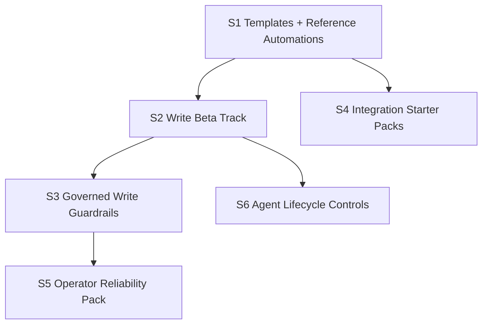

# V0.9 Execution Overview

Date: 2026-03-05

## Cross-Step Dependency Graph

## Review Flow

- Implement one step per feature branch.
- Stop after each step for review/approval.
- Merge only after approval.
- Continue to next step from updated `main`.
