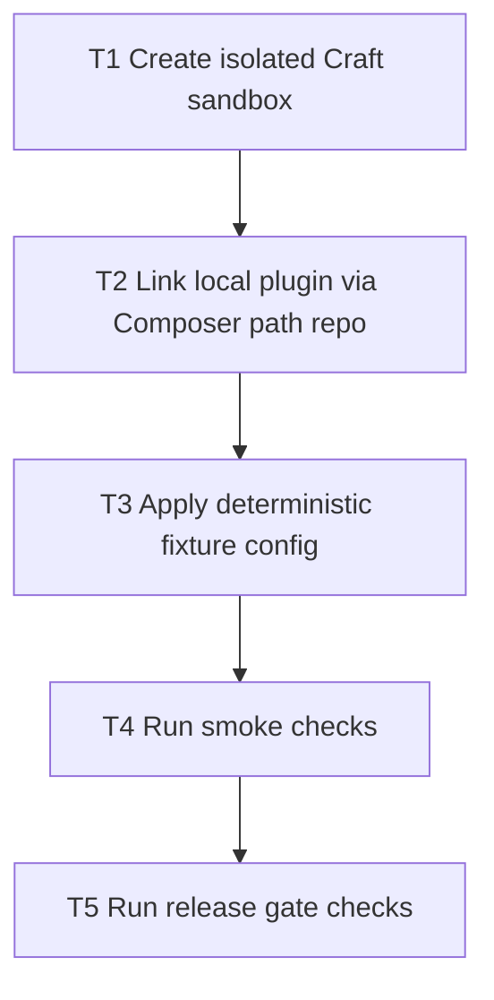

# Development Workflow

This plugin should be developed in a dedicated Craft sandbox, not directly inside a production-bound project.

## Dependency Graph



Tasks:

- `T1` `depends_on: []`
- `T2` `depends_on: [T1]`
- `T3` `depends_on: [T2]`
- `T4` `depends_on: [T3]`
- `T5` `depends_on: [T4]`

## 1) Create an isolated Craft sandbox

```bash
./scripts/dev/bootstrap-sandbox.sh ~/sites/agents-sandbox
```

Then complete Craft setup inside that sandbox:

- with DDEV: `ddev craft setup`
- without DDEV: `php craft setup`

## 2) Link this plugin as local source (path repo)

```bash
./scripts/dev/configure-local-plugin.sh ~/sites/agents-sandbox
```

`configure-local-plugin.sh` uses `link-mode=auto` by default:

- `symlink` when plugin path is inside sandbox tree
- `copy` when plugin path is outside sandbox tree (DDEV-safe default)

You can force behavior with a third argument: `auto`, `symlink`, or `copy`.

Install the plugin in the sandbox:

- with DDEV: `ddev craft plugin/install agents`
- without DDEV: `php craft plugin/install agents`

## 3) Apply deterministic local fixture config

```bash
./scripts/dev/apply-fixture-config.sh ~/sites/agents-sandbox agents-local-token
```

This updates the sandbox `.env` and writes `config/agents.php` with stable local defaults.

## 4) Run smoke checks against the sandbox

```bash
./scripts/dev/smoke-sandbox.sh https://agents-sandbox.ddev.site agents-local-token
```

## 5) Run release gate checks before tag/publish

```bash
./scripts/qa/release-gate.sh
```

Optional live check:

```bash
BASE_URL="https://agents-sandbox.ddev.site" TOKEN="agents-local-token" ./scripts/qa/release-gate.sh
```

Direct harnesses (optional while debugging):

```bash
./scripts/qa/webhook-regression-check.sh
./scripts/qa/incremental-regression-check.sh https://agents-sandbox.ddev.site agents-local-token
```

## 6) Restore a project back to plugin-store install

If you temporarily linked a project to local plugin code, restore it to a released version:

```bash
./scripts/dev/restore-store-install.sh ~/www/sites/coloursource ^0.1.3
```

## Production-bound projects (for example Coloursource)

Recommended policy:

- Keep `composer.json` pinned to released plugin versions (for example `^0.1.3`).
- Do not keep a permanent path repository override in those projects.
- If emergency local debugging is required, add a temporary path repository, test, then remove it immediately.
