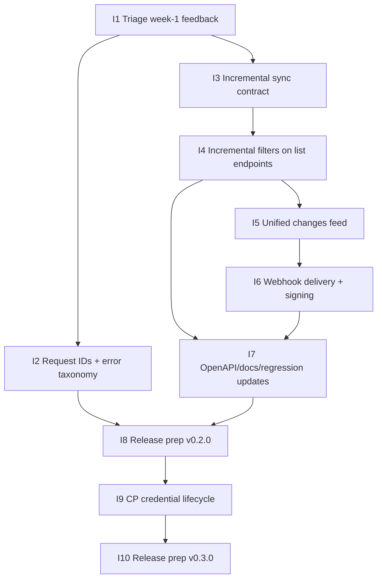

# GitHub Milestone and Issue Breakdown

Date: 2026-02-24  
Scope: Delivery plan for `v0.2.0` (incremental sync) and `v0.3.0` (credential lifecycle)

## Milestones

1. `M1` Stabilization + Observability (`v0.1.3` patch line)
   - Target date: 2026-03-10
   - Purpose: close launch feedback loop and harden diagnostics
2. `M2` Incremental Sync for Agents (`v0.2.0`)
   - Target date: 2026-04-07
   - Purpose: support checkpoint-based delta syncing and change feeds
3. `M3` Credential Lifecycle in CP (`v0.3.0`)
   - Target date: 2026-05-12
   - Purpose: safe credential rotation/revocation and operator visibility

## Dependency Graph

## Issues

### `I1` Triage week-1 adoption feedback

- `depends_on: []`
- Milestone: `M1`
- Labels: `triage`, `support`, `release`
- Acceptance criteria:
  - P0/P1 launch defects are triaged with owners.
  - High-impact fixes are either shipped or scheduled in patch scope.

### `I2` Add request IDs + stable error taxonomy

- `depends_on: [I1]`
- Milestone: `M1`
- Labels: `api`, `observability`, `security`
- Acceptance criteria:
  - All API errors include stable machine-readable code.
  - Request ID is returned and logged for each API request.

### `I3` Define incremental sync contract (`cursor`/`updatedSince`)

- `depends_on: [I1]`
- Milestone: `M2`
- Labels: `api`, `spec`, `documentation`
- Acceptance criteria:
  - Contract defines checkpoint progression, ordering, replay, and deletion semantics.
  - Contract is approved and reflected in task descriptions for implementation issues.

### `I4` Implement incremental filters on `/products`, `/orders`, `/entries`

- `depends_on: [I3]`
- Milestone: `M2`
- Labels: `api`, `backend`, `performance`
- Acceptance criteria:
  - Endpoints support incremental fetches from a saved checkpoint.
  - Existing list behavior remains backward compatible.

### `I5` Implement `GET /agents/v1/changes` feed

- `depends_on: [I4]`
- Milestone: `M2`
- Labels: `api`, `backend`, `feature`
- Acceptance criteria:
  - Feed returns normalized change entries with stable ordering.
  - Feed supports deterministic continuation with a checkpoint/cursor.

### `I6` Add webhook delivery for change notifications (HMAC-signed)

- `depends_on: [I5]`
- Milestone: `M2`
- Labels: `api`, `security`, `integration`
- Acceptance criteria:
  - Webhook payloads are signed and verifiable by consumers.
  - Retry and failure behavior is defined/documented.

### `I7` Update OpenAPI/capabilities/docs and add regression tests

- `depends_on: [I4, I6]`
- Milestone: `M2`
- Labels: `docs`, `tests`, `api`
- Acceptance criteria:
  - `/openapi.json` and `/capabilities` reflect all new sync features.
  - Regression tests cover ordering, replay, and deletion/tombstone flows.

### `I8` Release `v0.2.0` (incremental sync)

- `depends_on: [I2, I7]`
- Milestone: `M2`
- Labels: `release`
- Acceptance criteria:
  - `CHANGELOG.md` and `README.md` updated.
  - Tag `v0.2.0` created and published after release verification.

### `I9` Control Panel credential lifecycle (rotate/revoke/last-used)

- `depends_on: [I8]`
- Milestone: `M3`
- Labels: `cp`, `security`, `ux`
- Acceptance criteria:
  - Operators can rotate/revoke credentials in CP.
  - Last-used metadata is visible for operator decision making.

### `I10` Release `v0.3.0` (credential lifecycle)

- `depends_on: [I9]`
- Milestone: `M3`
- Labels: `release`
- Acceptance criteria:
  - Migration notes and rollout checklist are published.
  - Tag `v0.3.0` created and published.

## GitHub Setup Checklist

- [ ] Create milestones `M1`, `M2`, `M3` with target dates above.
- [ ] Create issues `I1`..`I10` with the dependencies listed.
- [ ] Link dependent issues using issue references (for example, `blocked by #123`).
- [ ] Pin `I8` and `I10` as milestone release gate issues.
