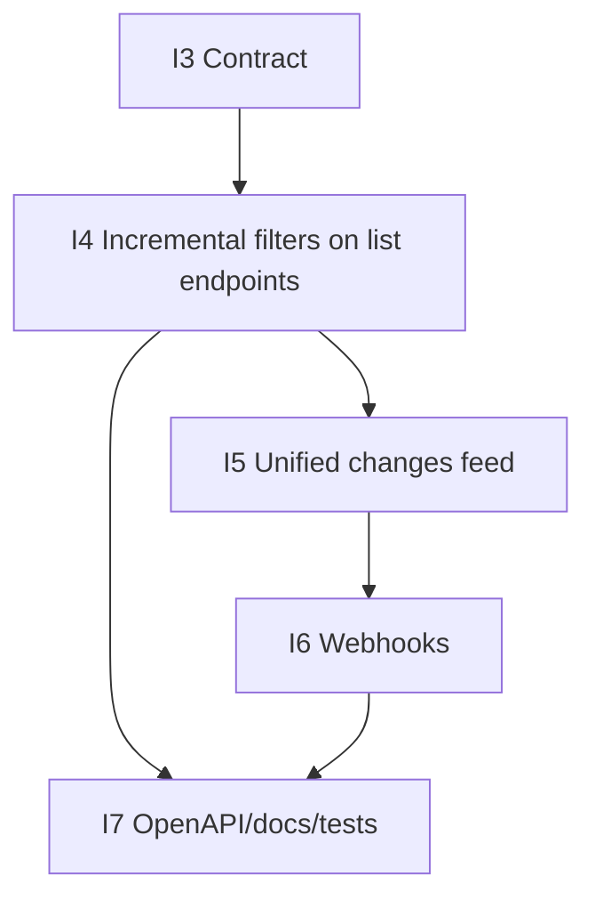

# Incremental Sync Contract (v0.2.0 Target)

Date: 2026-02-24  
Status: Draft for implementation (`I3`)  
Applies to: planned incremental sync support for `/agents/v1/*` list and changes endpoints

## Purpose

Define deterministic, no-gap checkpoint sync behavior for agents so consumers can:

- pull only changed records after initial backfill
- recover safely after interruptions
- handle deletes without full re-syncs

## Dependency Graph

## Scope

Planned endpoint coverage:

- Existing list endpoints with incremental filters:
  - `GET /agents/v1/products`
  - `GET /agents/v1/orders`
  - `GET /agents/v1/entries`
- New normalized changes feed:
  - `GET /agents/v1/changes`

Out of scope for this contract:

- write/mutation operations
- schema-level payload field redesign for existing list endpoints

## Checkpoint Model

Two checkpoint inputs are supported for incremental pulls:

1. `cursor` (preferred): opaque server-issued continuation token.
2. `updatedSince` (bootstrap): RFC3339 UTC timestamp for first incremental window.

Rules:

- If both are present, `cursor` takes precedence.
- `updatedSince` is inclusive.
- `cursor` is opaque and must not be parsed by clients.
- `cursor` expiration behavior must be explicit (`400 INVALID_REQUEST` with actionable message).

## Ordering and Determinism

For incremental mode, records are ordered by a stable tuple:

1. `updatedAt` ascending
2. resource primary key (`id`) ascending as deterministic tie-breaker

Guarantees:

- No-gap progression when advancing from one cursor to the next.
- At-least-once delivery across retries (duplicates possible, loss not allowed).
- Idempotency expected at consumer side via dedupe key (`resourceType + id + updatedAt + action` for change events).

## Deletes and Tombstones

Delete signaling is provided by `/agents/v1/changes`.

Tombstone event shape (minimum fields):

- `resourceType` (`product|order|entry`)
- `resourceId` (string)
- `action` (`deleted`)
- `updatedAt` (RFC3339 UTC)

List endpoints may omit deleted resources entirely; consumers needing delete awareness must read `/changes`.

## Endpoint Contracts (Planned)

### 1) Incremental list endpoints

Query params (additive to existing params):

- `updatedSince` (optional, RFC3339 UTC)
- `cursor` (optional, opaque)
- `limit` (existing; bounded)

Response additions:

- `page.nextCursor` (string|null)
- `page.hasMore` (bool)
- `page.syncMode` (`full|incremental`)

Behavior:

- No params: current full-list behavior (backward compatible).
- `updatedSince` or `cursor` present: incremental mode.

### 2) `GET /agents/v1/changes`

Query params:

- `types` (optional comma list: `products,orders,entries`)
- `updatedSince` (optional, RFC3339 UTC; bootstrap only)
- `cursor` (optional, opaque)
- `limit` (optional bounded integer)

Response shape:

- `data[]` change items:
  - `resourceType`
  - `resourceId`
  - `action` (`created|updated|deleted`)
  - `updatedAt`
  - `snapshot` (nullable minimal object for `created|updated`; null for deleted tombstones)
- `page`:
  - `nextCursor`
  - `hasMore`
  - `count`

## Error and Retry Contract

Uses existing stable API error schema:

- `INVALID_REQUEST` (`400`) for malformed timestamp/cursor or invalid param combinations
- `UNAUTHORIZED` (`401`)
- `FORBIDDEN` (`403`)
- `RATE_LIMIT_EXCEEDED` (`429`)

Retry guidance:

- `429`: retry after `X-RateLimit-Reset`.
- expired/invalid cursor (`400 INVALID_REQUEST`): restart from safe fallback checkpoint (`updatedSince` or fresh backfill).

## Webhook Alignment (for I6)

Webhook event payload semantics must mirror `/changes` items:

- same `resourceType`, `resourceId`, `action`, `updatedAt`
- HMAC signature verification required
- replay-safe via event id + timestamp window

## Compatibility Commitments

- Existing non-incremental calls remain valid without parameter changes.
- New params/fields are additive.
- Cursor tokens are opaque implementation detail and may change format.

## Acceptance Checklist

- [ ] Deterministic ordering defined and testable.
- [ ] Cursor precedence and expiration behavior defined.
- [ ] Delete signaling/tombstone rules defined.
- [ ] Retry/dedupe semantics documented for clients.
- [ ] Downstream implementation issues reference this contract.
