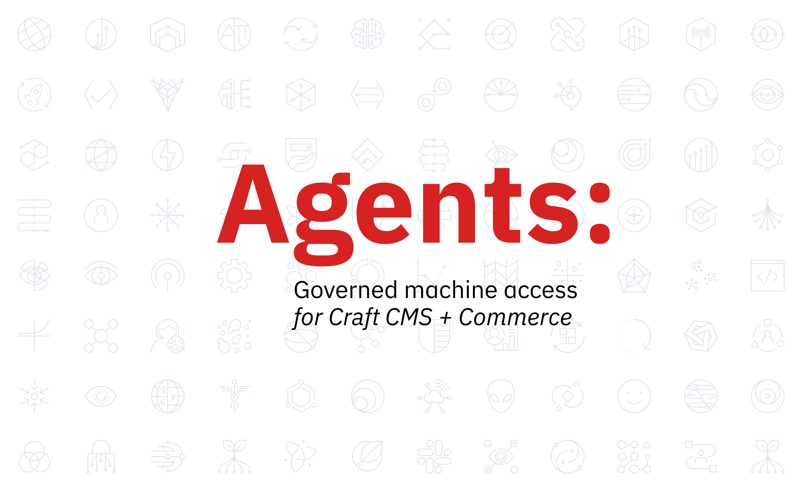

# Agents

Governed machine access for Craft CMS and Craft Commerce.



Current plugin version: **0.27.0**

Agents gives Craft a safe API and control plane for AI agents, automations, and integrations. It is the governed machine-access layer for Craft CMS and Craft Commerce, combining scoped APIs, managed credentials, diagnostics, and optional approval controls so production behavior stays predictable, observable, and auditable.

Agents is designed for agencies and delivery teams that manage Craft sites on behalf of clients. It gives those teams a governed way to introduce automation without losing visibility, approval control, or operational accountability.

## Product Direction

Near-term product work is focused on two outcomes:

- safer automation inside explicit client boundaries
- reusable workflow kits that teams can adapt across multiple sites

That means making it easier to automate approved content or commerce lanes safely, and easier to turn successful automation patterns into repeatable delivery work instead of one-off implementation effort.

## Documentation

- Public docs: https://marcusscheller.com/docs/agents/
- First worker guide: https://marcusscheller.com/docs/agents/get-started/first-worker
- API overview: https://marcusscheller.com/docs/agents/api/
- External plugin adapters: https://marcusscheller.com/docs/agents/api/external-plugin-adapters
- Control panel: https://marcusscheller.com/docs/agents/cp/
- Security and execution model: https://marcusscheller.com/docs/agents/security/
- Changelog: [CHANGELOG.md](CHANGELOG.md)

## Requirements

- PHP `^8.2`
- Craft CMS `^5.0`

## Installation

```bash
composer require klick/agents:^0.27.0
php craft plugin/install agents
```

You can also install Agents from the Craft Plugin Store in the control panel.

## Support

- Docs: https://marcusscheller.com/docs/agents/
- Issues: https://github.com/klick/agents/issues
- Source: https://github.com/klick/agents
