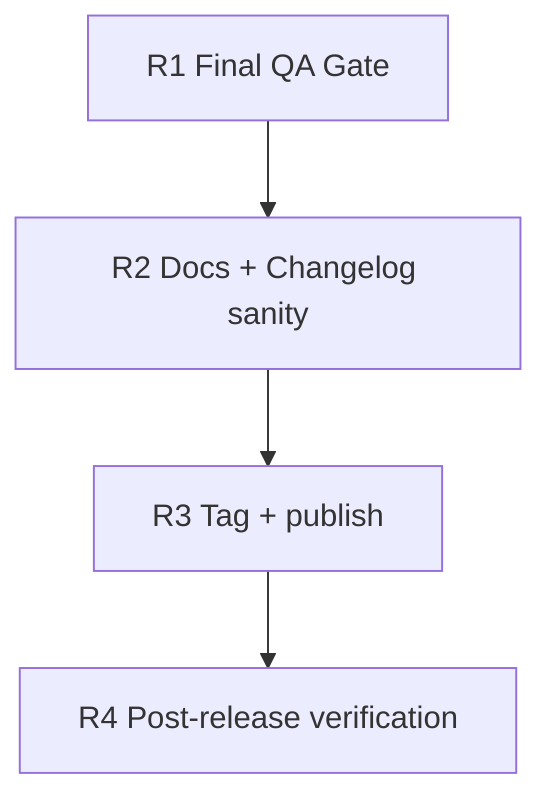

# v0.2.0 Release Checklist

Owner: Agents maintainers
Date: 2026-02-26

## Dependency Graph

## Tasks

- `R1` `depends_on: []`
  - Run `./scripts/qa/release-gate.sh`
  - For sandbox validation, run:
    - `BASE_URL="https://agents-sandbox.ddev.site" TOKEN="<token>" ./scripts/qa/release-gate.sh`
  - Confirm both `scripts/qa/webhook-regression-check.sh` and `scripts/qa/incremental-regression-check.sh` pass.

- `R2` `depends_on: [R1]`
  - Verify `README.md` and `CHANGELOG.md` match shipped behavior.
  - Verify OpenAPI and capabilities output are version-consistent and include guarded-error semantics.

- `R3` `depends_on: [R2]`
  - Create annotated tag: `v0.2.0`.
  - Publish release notes including migration guidance from `0.1.x` incremental adopters.

- `R4` `depends_on: [R3]`
  - Smoke-check `/agents/v1/health`, `/agents/v1/readiness`, `/agents/v1/changes`, `/agents/v1/openapi.json`.
  - Confirm no unexpected 4xx/5xx drift in first 24h after release.
