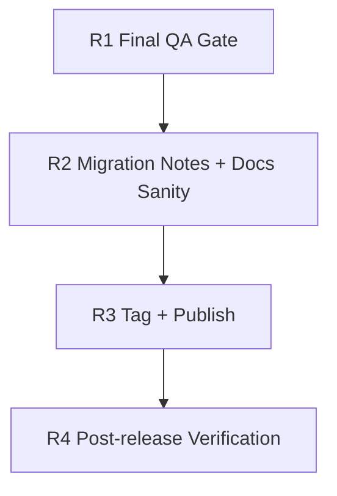

# v0.3.0 Release Checklist

Owner: Agents maintainers  
Date: 2026-02-26

## Dependency Graph

## Tasks

- `R1` `depends_on: []`
  - Run `./scripts/qa/release-gate.sh`
  - Confirm webhook and credential lifecycle regression checks pass.
  - Optional sandbox check:
    - `BASE_URL="https://agents-sandbox.ddev.site" TOKEN="<token>" ./scripts/qa/release-gate.sh`

- `R2` `depends_on: [R1]`
  - Verify `README.md` and `CHANGELOG.md` reflect credential lifecycle behavior.
  - Verify migration notes for managed credentials are published.
  - Verify permission keys are documented for CP credential actions.

- `R3` `depends_on: [R2]`
  - Create annotated tag: `v0.3.0`.
  - Publish release notes with rollout guidance for existing env-credential users.

- `R4` `depends_on: [R3]`
  - Smoke-check:
    - `/agents/v1/health`
    - `/agents/v1/capabilities`
    - `/agents/v1/openapi.json`
  - In CP, confirm credentials tab is visible and action permissions are honored.
