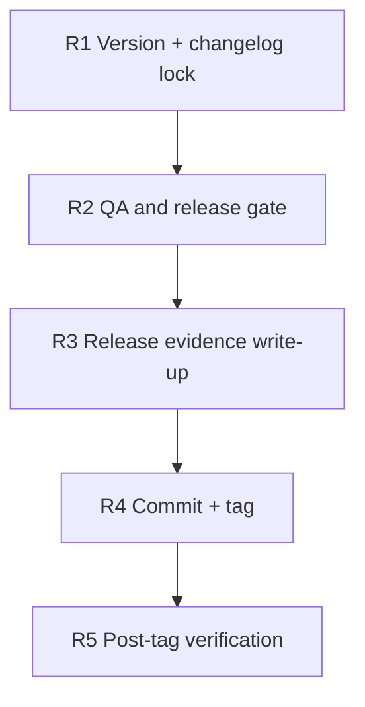

# v0.3.10 Release Checklist

Owner: Agents maintainers  
Date: 2026-03-02

## Dependency Graph

## Tasks

- `R1` `depends_on: []`
  - Bump version in `composer.json` and README current version line.
  - Move current `Unreleased` notes into `## 0.3.10 - 2026-03-02`.
  - Ensure install snippet reflects `^0.3.10`.
  - Keep changelog/release notes user-facing; exclude internal political/org commentary.

- `R2` `depends_on: [R1]`
  - Run `./scripts/qa/release-gate.sh`.
  - Confirm PHP lint, webhook regression, and credential lifecycle checks pass.
  - Optional live checks remain gated behind `BASE_URL` and `TOKEN`.

- `R3` `depends_on: [R2]`
  - Write `VALIDATION_v0.3.10.md` with executed commands and outcomes.
  - Capture skipped checks (if any) and rationale.

- `R4` `depends_on: [R3]`
  - Commit release payload.
  - Create annotated tag `v0.3.10`.

- `R5` `depends_on: [R4]`
  - Verify `git show v0.3.10 --no-patch` resolves correctly.
  - Verify working tree is clean after tagging.
