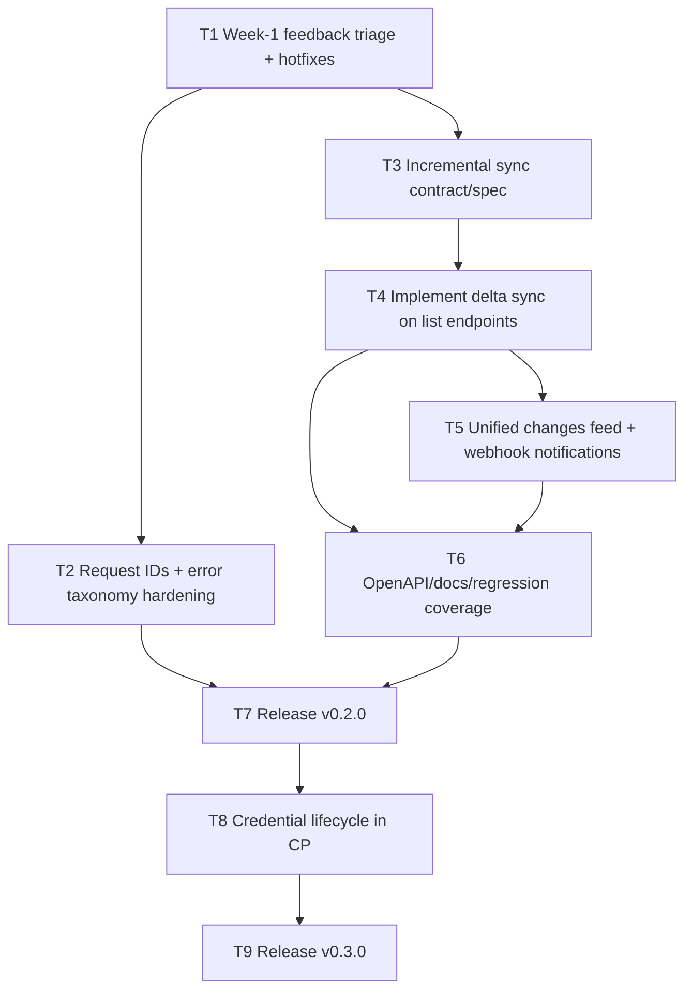

# Agents Plugin Roadmap

Date: 2026-02-24  
Current release: `v0.1.2`  
Next feature focus: Incremental sync for agents (`v0.2.0`)

## Objectives

- Improve integration reliability for external/internal agents.
- Reduce sync cost and rate-limit pressure.
- Keep API surface read-only while expanding operational utility.

## Dependency Graph

Critical path: `T1 -> T3 -> T4 -> T5 -> T6 -> T7 -> T8 -> T9`

## Tasks

### `T1` Week-1 feedback triage + hotfixes

- `depends_on: []`
- Window: 2026-02-24 to 2026-03-03
- Scope:
  - Triage first production feedback after `v0.1.2`.
  - Patch high-impact defects quickly (as `v0.1.x` if needed).
  - Capture repeated integration pain points as roadmap inputs.

Acceptance criteria:
- No open `P0` defects from first-week adoption.
- Top recurring support issues documented with owner + priority.

### `T2` Request IDs + error taxonomy hardening

- `depends_on: [T1]`
- Window: 2026-03-02 to 2026-03-10
- Scope:
  - Add request correlation IDs in API responses/logs.
  - Standardize error payloads and stable error codes.
  - Document troubleshooting flow in README.

Acceptance criteria:
- All guarded endpoints return traceable request IDs.
- Error responses are schema-consistent across endpoints.

### `T3` Incremental sync contract/spec

- `depends_on: [T1]`
- Window: 2026-03-03 to 2026-03-10
- Scope:
  - Define checkpoint semantics (`cursor` and/or `updatedSince`).
  - Define ordering, deduplication, and replay behavior.
  - Define deletion signaling (tombstones/change actions).

Acceptance criteria:
- Spec defines no-gap/no-loss sync behavior.
- Cursor/checkpoint behavior is deterministic and testable.

### `T4` Implement delta sync on list endpoints

- `depends_on: [T3]`
- Window: 2026-03-10 to 2026-03-24
- Scope:
  - Extend `/products`, `/orders`, `/entries` with incremental filters.
  - Guarantee stable sort/order for checkpoint progression.
  - Preserve backward compatibility for existing callers.

Acceptance criteria:
- Integrations can fetch only changed records since checkpoint.
- Existing non-incremental calls continue to behave unchanged.

### `T5` Unified changes feed + webhook notifications

- `depends_on: [T4]`
- Window: 2026-03-17 to 2026-03-31
- Scope:
  - Add `GET /agents/v1/changes` with normalized change entries.
  - Add optional webhook delivery for change events.
  - Sign webhook payloads (HMAC) and document verification.

Acceptance criteria:
- Changes feed supports reliable checkpoint progression.
- Webhook deliveries are signed and verifiable.

### `T6` OpenAPI/docs/regression coverage

- `depends_on: [T4, T5]`
- Window: 2026-03-24 to 2026-04-07
- Scope:
  - Update `/capabilities` and `/openapi.json`.
  - Add regression tests for incremental sync edge cases.
  - Update README examples for sync workflows.

Acceptance criteria:
- New sync routes/params are fully represented in OpenAPI/capabilities.
- Regression suite covers ordering, replay, and delete signaling.

### `T7` Release `v0.2.0` (incremental sync)

- `depends_on: [T2, T6]`
- Target date: 2026-04-07
- Scope:
  - Release notes, upgrade guidance, and compatibility notes.
  - Final verification on clean install and upgrade path.

Acceptance criteria:
- `v0.2.0` tagged and published with validated install/upgrade path.

### `T8` Credential lifecycle in Control Panel

- `depends_on: [T7]`
- Window: 2026-04-07 to 2026-05-05
- Scope:
  - Add credential rotation/revocation UX.
  - Add last-used metadata for keys/tokens.
  - Tighten operator workflow for secure key management.

Acceptance criteria:
- Operators can rotate/revoke credentials without manual env surgery.
- Credential usage visibility is available in CP.

### `T9` Release `v0.3.0` (credential lifecycle)

- `depends_on: [T8]`
- Target date: 2026-05-12
- Scope:
  - Finalize docs and migration notes.
  - Publish release with support runbook updates.

Acceptance criteria:
- `v0.3.0` tagged and published with migration guidance.

